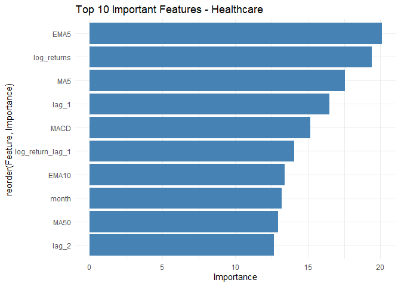

<!-- README.md is generated from README.Rmd. Please edit that file -->

# stocksr

<!-- badges: start -->

[](https://github.com/omnia99-hub/stocksr/actions/workflows/R-CMD-check.yaml)
<!-- badges: end -->

## The **`stocksr`** R package is designed to facilitate the cleaning, transformation, analysis, and modeling of sector-level stock market data, specifically leveraging S&P 500 daily price data (2010–2020). It is useful for financial data scientists, analysts, and students exploring time-series modeling, technical indicators, and sector-based financial insights.

## Overview

This package provides a comprehensive framework to: - Load and clean raw
stock data from Excel files - Segment data by market sectors (e.g.,
Technology, Healthcare) - Compute key technical indicators (e.g., MACD,
RSI, Bollinger Bands) - Construct machine learning models such as Random
Forests - Compare model performance across different market sectors

### Data Preparation

- `load_and_preprocess_data()`: Load data and organize by sectors.
- `calculate_sector_index()`: Aggregate individual stock prices into
  sector-level index series.

### Feature Engineering

- `calculate_technical_indicators()`: Compute popular technical
  indicators (RSI, MACD, etc.) for each sector.
- `prepare_data_for_lstm()`: Format data into 3D sequences for LSTM
  input.

### Modeling

- `build_random_forest_model()`: Train a Random Forest model to predict
  stock movements based on engineered features.

## Installation

You can install the development version of stocksr from
[GitHub](https://github.com/) with:

``` r
# install.packages("pak")
pak::pak("omnia99-hub/stocksr")
```

## Example

``` r
devtools::load_all(".")
#> ℹ Loading stocksr
library(stocksr)
```

``` r
library(ggplot2)
library(dplyr)
#> 
#> Attaching package: 'dplyr'
#> The following object is masked from 'package:randomForest':
#> 
#>     combine
#> The following object is masked from 'package:testthat':
#> 
#>     matches
#> The following objects are masked from 'package:stats':
#> 
#>     filter, lag
#> The following objects are masked from 'package:base':
#> 
#>     intersect, setdiff, setequal, union
library(readxl)
```

# Step 1: Load and preprocess raw CSV data

``` r
data(df_cleaned2)
sectors <- load_and_preprocess_data(df_cleaned2)
head(sectors)
#> $Energy
#>           Date chevron conocophillips schlumberger
#> 1   2010-01-01 76.9900        38.9317        65.09
#> 2   2010-01-04 79.0600        40.0828        67.11
#> 3   2010-01-05 79.6200        40.1209        67.30
#> 4   2010-01-06 79.6300        40.4106        68.80
#> 5   2010-01-07 79.3300        40.2505        69.51
#> 6   2010-01-08 79.4700        40.6012        70.65
#> 7   2010-01-11 80.8800        40.8375        70.65
#> 8   2010-01-12 80.4100        39.9684        69.59
#> 9   2010-01-13 79.8000        40.2200        70.85
#> 10  2010-01-14 79.5500        40.3877        71.29
#> 11  2010-01-15 79.2300        40.4182        70.83
#> 12  2010-01-18 79.2300        40.4182        70.83
#> 13  2010-01-19 79.6800        40.9442        70.93
#> 14  2010-01-20 78.1500        40.4487        69.09
#> 15  2010-01-21 76.2400        39.8236        68.31
#> 16  2010-01-22 74.5900        38.5734        65.24
#> 17  2010-01-25 74.5500        38.6878        65.81
#> 18  2010-01-26 74.1500        38.4438        65.75
#> 19  2010-01-27 73.7000        37.9712        65.70
#> 20  2010-01-28 73.2400        36.8582        64.63
#> 21  2010-01-29 72.1200        36.5914        63.46
#> 22  2010-02-01 73.5800        37.4070        64.79
#> 23  2010-02-02 74.4500        38.2304        66.12
#> 24  2010-02-03 73.2100        38.1084        65.99
#> 25  2010-02-04 71.3700        36.7133        62.50
#> 26  2010-02-05 71.1800        36.5761        62.06
#> 27  2010-02-08 70.1300        36.1111        62.12
#> 28  2010-02-09 71.3100        36.9649        63.76
#> 29  2010-02-10 70.7500        36.7896        63.65
#> 30  2010-02-11 71.7300        37.2775        64.76
#> 31  2010-02-12 71.0100        37.1021        64.30
#> 32  2010-02-15 71.0100        37.1021        64.30
#> 33  2010-02-16 72.9900        38.0550        65.65
#> 34  2010-02-17 72.8400        37.5824        65.43
#> 35  2010-02-18 73.6200        37.2546        65.81
#> 36  2010-02-19 74.0500        37.2775        63.90
#> 37  2010-02-22 72.9600        37.1250        61.57
#> 38  2010-02-23 72.0400        36.4770        60.88
#> 39  2010-02-24 72.3400        36.8582        60.91
#> 40  2010-02-25 72.1100        36.8201        60.81
#> 41  2010-02-26 72.3000        36.5914        61.10
#> 42  2010-03-01 72.8100        37.2851        61.42
#> 43  2010-03-02 73.3200        37.8949        62.81
#> 44  2010-03-03 73.1300        37.6434        63.23
#> 45  2010-03-04 73.0800        37.6129        62.88
#> 46  2010-03-05 74.3000        38.4286        63.81
#> 47  2010-03-08 74.6400        38.6725        64.48
#> 48  2010-03-09 74.3000        38.7640        64.10
#> 49  2010-03-10 73.9600        39.2366        64.20
#> 50  2010-03-11 73.9900        39.1070        63.90
#> 51  2010-03-12 73.7200        39.3967        64.54
#> 52  2010-03-15 73.5700        39.3738        64.31
#> 53  2010-03-16 73.9800        39.7702        65.52
#> 54  2010-03-17 74.6700        40.3877        66.60
#> 55  2010-03-18 74.7600        40.1819        65.25
#> 56  2010-03-19 74.9800        39.9227        64.32
#> 57  2010-03-22 74.4600        39.7169        63.49
#> 58  2010-03-23 74.7700        40.0294        63.03
#> 59  2010-03-24 73.9300        40.0447        62.21
#> 60  2010-03-25 73.8000        39.2824        60.76
#> 61  2010-03-26 74.4300        38.8936        61.67
#> 62  2010-03-29 75.2300        38.9927        63.07
#> 63  2010-03-30 75.3000        39.0765        63.05
#> 64  2010-03-31 75.8300        39.0079        63.46
#> 65  2010-04-01 76.6900        39.6559        64.57
#> 66  2010-04-02 76.6900        39.6559        64.57
#> 67  2010-04-05 77.6600        40.6164        65.77
#> 68  2010-04-06 77.8800        40.6317        66.79
#> 69  2010-04-07 77.3700        40.3344        66.04
#> 70  2010-04-08 77.6600        41.1196        66.62
#> 71  2010-04-09 79.5000        42.1716        66.53
#> 72  2010-04-12 80.4300        42.6594        66.31
#> 73  2010-04-13 80.2100        42.4384        65.51
#> 74  2010-04-14 80.5800        43.3684        67.10
#> 75  2010-04-15 81.5900        43.4980        67.21
#> 76  2010-04-16 80.7500        42.7281        65.80
#> 77  2010-04-19 81.3200        43.1778        65.24
#> 78  2010-04-20 82.0500        43.7572        67.85
#> 79  2010-04-21 81.9200        43.6200        68.02
#> 80  2010-04-22 81.2000        43.4370        68.18
#> 81  2010-04-23 82.6700        44.2832        72.68
#> 82  2010-04-26 82.5900        44.4433        72.69
#> 83  2010-04-27 80.2300        43.8639        70.31
#> 84  2010-04-28 80.6200        44.6339        71.01
#> 85  2010-04-29 82.2900        45.0531        73.15
#> 86  2010-04-30 81.4400        45.1217        71.42
#> 87  2010-05-03 82.8300        45.5105        71.31
#> 88  2010-05-04 80.7600        44.2222        68.95
#> 89  2010-05-05 80.1900        43.2693        67.30
#> 90  2010-05-06 77.2000        41.9962        65.35
#> 91  2010-05-07 77.1000        41.6837        62.86
#> 92  2010-05-10 79.8900        43.2007        66.83
#> 93  2010-05-11 79.7000        43.6657        66.84
#> 94  2010-05-12 80.0600        43.9706        66.65
#> 95  2010-05-13 78.9200        43.4065        66.94
#> 96  2010-05-14 77.8300        42.5680        64.88
#> 97  2010-05-17 77.7300        42.0724        64.15
#> 98  2010-05-18 76.8475        41.6761        63.74
#> 99  2010-05-19 76.6000        41.0967        62.59
#> 100 2010-05-20 73.6000        38.8250        59.22
#> 101 2010-05-21 74.4800        39.2366        60.50
#> 102 2010-05-24 73.4400        38.1999        57.60
#> 103 2010-05-25 72.5700        38.0550        58.46
#> 104 2010-05-26 71.5500        37.7882        58.75
#> 105 2010-05-27 74.3600        39.8008        60.02
#> 106 2010-05-28 73.8700        39.5339        56.15
#> 107 2010-05-31 73.8700        39.5339        56.15
#> 108 2010-06-01 72.2900        38.3676        51.75
#> 109 2010-06-02 74.1300        40.0142        56.31
#> 110 2010-06-03 73.9100        39.6254        56.63
#> 111 2010-06-04 71.2800        38.1618        55.74
#> 112 2010-06-07 71.3500        37.8035        54.23
#> 113 2010-06-08 71.0225        38.7564        55.56
#> 114 2010-06-09 70.7900        38.6649        55.47
#> 115 2010-06-10 74.1700        40.6850        59.17
#> 116 2010-06-11 74.0600        40.7841        59.48
#> 117 2010-06-14 74.1800        40.2505        58.66
#> 118 2010-06-15 75.2300        41.3940        60.87
#> 119 2010-06-16 74.9500        41.5236        60.81
#> 120 2010-06-17 75.3200        42.0648        61.36
#> 121 2010-06-18 75.5200        42.6976        60.53
#> 122 2010-06-21 75.7200        42.5375        60.33
#> 123 2010-06-22 74.0000        41.5160        58.26
#> 124 2010-06-23 72.2600        40.7917        58.33
#> 125 2010-06-24 70.8300        40.0294        57.14
#> 126 2010-06-25 70.0600        39.5797        58.22
#> 127 2010-06-28 69.9600        39.0232        57.34
#> 128 2010-06-29 68.3600        37.9940        55.08
#> 129 2010-06-30 67.8600        37.4223        55.34
#> 130 2010-07-01 67.4800        37.2546        55.26
#> 131 2010-07-02 67.3100        37.2165        54.96
#> 132 2010-07-05 67.3100        37.2165        54.96
#> 133 2010-07-06 67.5600        37.5061        55.54
#> 134 2010-07-07 69.4500        39.0003        57.54
#> 135 2010-07-08 70.4100        39.2976        58.54
#> 136 2010-07-09 71.8400        39.8693        58.56
#> 137 2010-07-12 71.8500        39.7169        58.25
#> 138 2010-07-13 73.2300        40.5707        58.62
#> 139 2010-07-14 73.0500        40.2505        58.89
#> 140 2010-07-15 73.0400        40.2962        58.67
#> 141 2010-07-16 71.5000        39.5263        56.68
#> 142 2010-07-19 72.0000        39.5187        59.15
#> 143 2010-07-20 73.1000        40.1438        61.04
#> 144 2010-07-21 72.1700        39.7321        59.59
#> 145 2010-07-22 73.4400        40.6088        61.30
#> 146 2010-07-23 73.5200        41.0052        59.35
#> 147 2010-07-26 74.6200        41.4931        58.85
#> 148 2010-07-27 75.3000        41.5007        58.93
#> 149 2010-07-28 75.5600        41.5007        59.73
#> 150 2010-07-29 76.0200        41.5922        59.81
#> 151 2010-07-30 76.2100        42.0953        59.66
#> 152 2010-08-02 77.8000        43.8563        62.74
#> 153 2010-08-03 78.6600        43.8792        62.86
#> 154 2010-08-04 79.0200        43.7724        62.92
#> 155 2010-08-05 79.0700        43.9859        63.26
#> 156 2010-08-06 78.7300        43.3989        62.34
#> 157 2010-08-09 79.2900        43.6886        62.75
#> 158 2010-08-10 79.0400        43.3532        62.15
#> 159 2010-08-11 77.1300        42.3164        60.06
#> 160 2010-08-12 77.0700        42.1944        59.30
#> 161 2010-08-13 77.4000        41.9429        58.76
#> 162 2010-08-16 77.7100        41.8743        59.37
#> 163 2010-08-17 77.7700        42.5909        60.31
#> 164 2010-08-18 77.0400        42.2478        59.18
#> 165 2010-08-19 75.8400        41.7065        57.82
#> 166 2010-08-20 75.0500        41.0815        56.46
#> 167 2010-08-23 75.0500        40.9442        55.82
#> 168 2010-08-24 73.7800        40.7308        54.77
#> 169 2010-08-25 74.0700        40.7536        54.69
#> 170 2010-08-26 73.3300        39.9532        53.46
#> 171 2010-08-27 74.9300        40.7232        55.76
#> 172 2010-08-30 73.7800        40.1514        54.17
#> 173 2010-08-31 74.0800        39.9684        53.33
#> 174 2010-09-01 76.7700        41.2110        55.18
#> 175 2010-09-02 77.4500        41.4931        56.42
#> 176 2010-09-03 78.0000        41.9657        57.37
#> 177 2010-09-06 78.0000        41.9657        57.37
#> 178 2010-09-07 77.0500        40.9061        57.13
#> 179 2010-09-08 77.2500        41.4092        58.34
#> 180 2010-09-09 77.3600        41.7218        58.53
#> 181 2010-09-10 78.8200        41.7370        59.31
#> 182 2010-09-13 79.2500        42.2173        60.15
#> 183 2010-09-14 79.5100        42.2097        58.85
#> 184 2010-09-15 79.2100        42.3545        58.19
#> 185 2010-09-16 79.0500        42.2021        58.18
#> 186 2010-09-17 78.4600        42.1334        58.10
#> 187 2010-09-20 79.9000        43.3227        58.84
#> 188 2010-09-21 79.7500        43.0863        59.29
#> 189 2010-09-22 79.2500        42.7357        58.98
#> 190 2010-09-23 78.5400        42.0953        58.11
#> 191 2010-09-24 80.1200        42.9644        60.64
#> 192 2010-09-27 80.0800        42.8882        59.86
#> 193 2010-09-28 80.8800        43.5209        60.29
#> 194 2010-09-29 81.2800        43.7267        61.52
#> 195 2010-09-30 81.0500        43.7800        61.61
#> 196 2010-10-01 81.9500        44.1078        62.43
#> 197 2010-10-04 81.3100        43.6505        61.20
#> 198 2010-10-05 83.3900        44.8168        62.96
#> 199 2010-10-06 83.8900        45.5105        63.13
#> 200 2010-10-07 83.5200        45.5181        62.99
#> 201 2010-10-08 83.9400        45.4419        63.56
#> 202 2010-10-11 83.7100        45.5791        63.50
#> 203 2010-10-12 83.8400        45.4419        62.66
#> 204 2010-10-13 83.6700        45.8383        64.62
#> 205 2010-10-14 83.9000        45.9832        64.26
#> 206 2010-10-15 83.6100        46.3338        64.50
#> 207 2010-10-18 84.4800        46.6998        64.51
#> 208 2010-10-19 82.7900        45.7392        63.14
#> 209 2010-10-20 84.0200        46.7074        64.29
#> 210 2010-10-21 84.2500        46.5930        64.31
#> 211 2010-10-22 84.5500        47.0123        67.77
#> 212 2010-10-25 84.8700        46.7607        68.53
#> 213 2010-10-26 85.1500        46.7836        69.11
#> 214 2010-10-27 84.3100        45.8002        69.24
#> 215 2010-10-28 84.4400        45.4190        69.78
#> 216 2010-10-29 82.6000        45.2723        69.89
#> 217 2010-11-01 81.4500        44.9388        70.17
#> 218 2010-11-02 82.1500        45.2361        71.47
#> 219 2010-11-03 82.7000        45.2895        72.21
#> 220 2010-11-04 85.1400        46.6921        75.80
#> 221 2010-11-05 84.9800        47.1190        75.66
#> 222 2010-11-08 84.8000        47.5764        74.84
#> 223 2010-11-09 83.5600        47.2867        73.92
#> 224 2010-11-10 85.1700        48.1863        74.65
#> 225 2010-11-11 86.0900        47.9423        75.02
#> 226 2010-11-12 85.4400        47.5840        74.11
#> 227 2010-11-15 84.8600        47.3172        74.30
#> 228 2010-11-16 82.4800        46.4558        73.18
#> 229 2010-11-17 82.4600        46.3567        74.40
#> 230 2010-11-18 83.8200        47.0733        75.50
#> 231 2010-11-19 83.9400        47.2029        76.43
#> 232 2010-11-22 83.4500        46.8751        76.40
#> 233 2010-11-23 81.7500        46.1356        75.44
#> 234 2010-11-24 82.9300        46.8446        77.15
#> 235 2010-11-25 82.9300        46.8446        77.15
#> 236 2010-11-26 82.1100        46.3567        76.08
#> 237 2010-11-29 81.6900        46.2576        77.00
#> 238 2010-11-30 80.9700        45.8688        77.34
#> 239 2010-12-01 82.7000        47.6069        80.85
#> 240 2010-12-02 84.5000        48.5598        80.74
#> 241 2010-12-03 84.8900        48.7275        82.74
#> 242 2010-12-06 84.9500        48.9257        82.86
#> 243 2010-12-07 86.3000        49.0706        81.00
#> 244 2010-12-08 86.1400        49.2535        80.90
#> 245 2010-12-09 86.6500        49.2993        81.24
#> 246 2010-12-10 87.0300        49.2306        81.54
#> 247 2010-12-13 88.3700        49.9091        82.43
#> 248 2010-12-14 88.3800        50.0463        81.33
#> 249 2010-12-15 88.0100        49.6423        80.72
#> 250 2010-12-16 89.0600        50.0616        81.13
#>  [ reached 'max' / getOption("max.print") -- omitted 2620 rows ]
#> 
#> $`Health Care`
#>           Date  pfizer
#> 1   2010-01-01 17.2432
#> 2   2010-01-04 17.9447
#> 3   2010-01-05 17.6887
#> 4   2010-01-06 17.6318
#> 5   2010-01-07 17.5655
#> 6   2010-01-08 17.7077
#> 7   2010-01-11 17.8499
#> 8   2010-01-12 17.7930
#> 9   2010-01-13 18.2101
#> 10  2010-01-14 18.3712
#> 11  2010-01-15 18.4755
#> 12  2010-01-18 18.4755
#> 13  2010-01-19 18.9590
#> 14  2010-01-20 18.9021
#> 15  2010-01-21 18.2385
#> 16  2010-01-22 17.9731
#> 17  2010-01-25 17.8688
#> 18  2010-01-26 17.8025
#> 19  2010-01-27 18.0110
#> 20  2010-01-28 17.6603
#> 21  2010-01-29 17.6887
#> 22  2010-02-01 17.8120
#> 23  2010-02-02 18.2385
#> 24  2010-02-03 17.6508
#> 25  2010-02-04 17.0915
#> 26  2010-02-05 17.0251
#> 27  2010-02-08 16.9114
#> 28  2010-02-09 16.9493
#> 29  2010-02-10 16.8166
#> 30  2010-02-11 16.9398
#> 31  2010-02-12 16.8735
#> 32  2010-02-15 16.8735
#> 33  2010-02-16 16.7976
#> 34  2010-02-17 16.7503
#> 35  2010-02-18 16.8071
#> 36  2010-02-19 17.0536
#> 37  2010-02-22 17.0157
#> 38  2010-02-23 16.7503
#> 39  2010-02-24 16.8830
#> 40  2010-02-25 16.7692
#> 41  2010-02-26 16.6365
#> 42  2010-03-01 16.8261
#> 43  2010-03-02 16.6839
#> 44  2010-03-03 16.4185
#> 45  2010-03-04 16.4279
#> 46  2010-03-05 16.5701
#> 47  2010-03-08 16.4469
#> 48  2010-03-09 16.3332
#> 49  2010-03-10 16.2573
#> 50  2010-03-11 16.3900
#> 51  2010-03-12 16.1909
#> 52  2010-03-15 16.3616
#> 53  2010-03-16 16.3616
#> 54  2010-03-17 16.3142
#> 55  2010-03-18 16.3332
#> 56  2010-03-19 16.0298
#> 57  2010-03-22 16.2573
#> 58  2010-03-23 16.6270
#> 59  2010-03-24 16.6934
#> 60  2010-03-25 16.4848
#> 61  2010-03-26 16.2478
#> 62  2010-03-29 16.3806
#> 63  2010-03-30 16.3616
#> 64  2010-03-31 16.2573
#> 65  2010-04-01 16.1909
#> 66  2010-04-02 16.1909
#> 67  2010-04-05 16.0203
#> 68  2010-04-06 16.0772
#> 69  2010-04-07 16.1815
#> 70  2010-04-08 16.2478
#> 71  2010-04-09 16.3521
#> 72  2010-04-12 16.3900
#> 73  2010-04-13 16.2858
#> 74  2010-04-14 16.1815
#> 75  2010-04-15 16.1056
#> 76  2010-04-16 15.9255
#> 77  2010-04-19 15.9161
#> 78  2010-04-20 15.8876
#> 79  2010-04-21 15.7359
#> 80  2010-04-22 15.6222
#> 81  2010-04-23 16.0298
#> 82  2010-04-26 15.9445
#> 83  2010-04-27 15.6032
#> 84  2010-04-28 15.6696
#> 85  2010-04-29 15.9824
#> 86  2010-04-30 15.8497
#> 87  2010-05-03 16.0298
#> 88  2010-05-04 16.3616
#> 89  2010-05-05 16.2858
#> 90  2010-05-06 15.8687
#> 91  2010-05-07 15.6032
#> 92  2010-05-10 16.1151
#> 93  2010-05-11 16.1246
#> 94  2010-05-12 16.0203
#> 95  2010-05-13 15.6980
#> 96  2010-05-14 15.3568
#> 97  2010-05-17 15.2714
#> 98  2010-05-18 14.9871
#> 99  2010-05-19 14.9966
#> 100 2010-05-20 14.4373
#> 101 2010-05-21 14.5984
#> 102 2010-05-24 14.4278
#> 103 2010-05-25 14.2761
#> 104 2010-05-26 14.3235
#> 105 2010-05-27 14.5700
#> 106 2010-05-28 14.4373
#> 107 2010-05-31 14.4373
#> 108 2010-06-01 14.2098
#> 109 2010-06-02 14.4088
#> 110 2010-06-03 14.4396
#> 111 2010-06-04 13.9870
#> 112 2010-06-07 13.7642
#> 113 2010-06-08 13.7927
#> 114 2010-06-09 13.7642
#> 115 2010-06-10 14.1339
#> 116 2010-06-11 14.6553
#> 117 2010-06-14 14.5321
#> 118 2010-06-15 14.7122
#> 119 2010-06-16 14.6743
#> 120 2010-06-17 14.6648
#> 121 2010-06-18 14.4183
#> 122 2010-06-21 14.3140
#> 123 2010-06-22 14.1908
#> 124 2010-06-23 14.1055
#> 125 2010-06-24 13.7073
#> 126 2010-06-25 13.8780
#> 127 2010-06-28 13.7832
#> 128 2010-06-29 13.5367
#> 129 2010-06-30 13.5178
#> 130 2010-07-01 13.4893
#> 131 2010-07-02 13.4040
#> 132 2010-07-05 13.4040
#> 133 2010-07-06 13.5462
#> 134 2010-07-07 13.8590
#> 135 2010-07-08 14.0486
#> 136 2010-07-09 14.0012
#> 137 2010-07-12 14.1529
#> 138 2010-07-13 14.0202
#> 139 2010-07-14 14.0676
#> 140 2010-07-15 14.0960
#> 141 2010-07-16 13.8021
#> 142 2010-07-19 13.9633
#> 143 2010-07-20 13.7927
#> 144 2010-07-21 13.7453
#> 145 2010-07-22 14.0391
#> 146 2010-07-23 13.8211
#> 147 2010-07-26 14.2382
#> 148 2010-07-27 14.4752
#> 149 2010-07-28 14.2192
#> 150 2010-07-29 14.3046
#> 151 2010-07-30 14.2192
#> 152 2010-08-02 14.6743
#> 153 2010-08-03 15.4895
#> 154 2010-08-04 15.5843
#> 155 2010-08-05 15.3473
#> 156 2010-08-06 15.3947
#> 157 2010-08-09 15.5653
#> 158 2010-08-10 15.7075
#> 159 2010-08-11 15.1672
#> 160 2010-08-12 15.3568
#> 161 2010-08-13 15.2430
#> 162 2010-08-16 15.1956
#> 163 2010-08-17 15.4231
#> 164 2010-08-18 15.2620
#> 165 2010-08-19 15.1956
#> 166 2010-08-20 15.0913
#> 167 2010-08-23 15.2620
#> 168 2010-08-24 14.9966
#> 169 2010-08-25 15.1577
#> 170 2010-08-26 15.0724
#> 171 2010-08-27 15.2525
#> 172 2010-08-30 15.0345
#> 173 2010-08-31 15.0819
#> 174 2010-09-01 15.4326
#> 175 2010-09-02 15.5464
#> 176 2010-09-03 15.6032
#> 177 2010-09-06 15.6032
#> 178 2010-09-07 15.4800
#> 179 2010-09-08 15.6980
#> 180 2010-09-09 15.8971
#> 181 2010-09-10 16.1056
#> 182 2010-09-13 16.0867
#> 183 2010-09-14 16.1909
#> 184 2010-09-15 16.3734
#> 185 2010-09-16 16.2715
#> 186 2010-09-17 16.1744
#> 187 2010-09-20 16.3758
#> 188 2010-09-21 16.2488
#> 189 2010-09-22 16.3237
#> 190 2010-09-23 16.1530
#> 191 2010-09-24 16.4943
#> 192 2010-09-27 16.2763
#> 193 2010-09-28 16.5180
#> 194 2010-09-29 16.4943
#> 195 2010-09-30 16.2763
#> 196 2010-10-01 16.2858
#> 197 2010-10-04 16.0203
#> 198 2010-10-05 16.3341
#> 199 2010-10-06 16.3616
#> 200 2010-10-07 16.4753
#> 201 2010-10-08 16.5512
#> 202 2010-10-11 16.4753
#> 203 2010-10-12 16.5692
#> 204 2010-10-13 16.8071
#> 205 2010-10-14 16.7408
#> 206 2010-10-15 16.8261
#> 207 2010-10-18 16.8735
#> 208 2010-10-19 16.4848
#> 209 2010-10-20 16.7408
#> 210 2010-10-21 16.7123
#> 211 2010-10-22 16.5891
#> 212 2010-10-25 16.7029
#> 213 2010-10-26 16.5796
#> 214 2010-10-27 16.3806
#> 215 2010-10-28 16.6555
#> 216 2010-10-29 16.5085
#> 217 2010-11-01 16.7029
#> 218 2010-11-02 16.5417
#> 219 2010-11-03 16.6744
#> 220 2010-11-04 16.4753
#> 221 2010-11-05 16.2858
#> 222 2010-11-08 16.1635
#> 223 2010-11-09 16.1056
#> 224 2010-11-10 15.9530
#> 225 2010-11-11 16.0962
#> 226 2010-11-12 15.9729
#> 227 2010-11-15 15.8782
#> 228 2010-11-16 15.7359
#> 229 2010-11-17 15.6222
#> 230 2010-11-18 15.9540
#> 231 2010-11-19 15.9232
#> 232 2010-11-22 15.7644
#> 233 2010-11-23 15.7075
#> 234 2010-11-24 15.8227
#> 235 2010-11-25 15.8227
#> 236 2010-11-26 15.6980
#> 237 2010-11-29 15.6980
#> 238 2010-11-30 15.4516
#> 239 2010-12-01 15.8322
#> 240 2010-12-02 15.8213
#> 241 2010-12-03 15.8497
#> 242 2010-12-06 15.9350
#> 243 2010-12-07 15.8971
#> 244 2010-12-08 15.8497
#> 245 2010-12-09 15.8862
#> 246 2010-12-10 16.1341
#> 247 2010-12-13 16.2952
#> 248 2010-12-14 16.2194
#> 249 2010-12-15 16.1909
#> 250 2010-12-16 16.3237
#> 251 2010-12-17 16.1436
#> 252 2010-12-20 16.2763
#> 253 2010-12-21 16.4753
#> 254 2010-12-22 16.6460
#> 255 2010-12-23 16.6934
#> 256 2010-12-24 16.6934
#> 257 2010-12-27 16.5796
#> 258 2010-12-28 16.6744
#> 259 2010-12-29 16.6839
#> 260 2010-12-30 16.5796
#> 261 2010-12-31 16.5986
#> 262 2011-01-03 16.7597
#> 263 2011-01-04 17.0522
#> 264 2011-01-05 17.1673
#> 265 2011-01-06 17.2337
#> 266 2011-01-07 17.3854
#> 267 2011-01-10 17.3095
#> 268 2011-01-11 17.2716
#> 269 2011-01-12 17.4138
#> 270 2011-01-13 17.2716
#> 271 2011-01-14 17.3854
#> 272 2011-01-17 17.3854
#> 273 2011-01-18 17.4233
#> 274 2011-01-19 17.3664
#> 275 2011-01-20 17.2906
#> 276 2011-01-21 17.4034
#> 277 2011-01-24 17.4897
#> 278 2011-01-25 17.5086
#> 279 2011-01-26 17.4043
#> 280 2011-01-27 17.5181
#> 281 2011-01-28 17.2053
#> 282 2011-01-31 17.2716
#> 283 2011-02-01 18.2196
#> 284 2011-02-02 17.9731
#> 285 2011-02-03 18.1722
#> 286 2011-02-04 18.2954
#> 287 2011-02-07 18.0489
#> 288 2011-02-08 18.1627
#> 289 2011-02-09 18.0584
#> 290 2011-02-10 18.0395
#> 291 2011-02-11 17.8475
#> 292 2011-02-14 18.0584
#> 293 2011-02-15 18.0584
#> 294 2011-02-16 18.2764
#> 295 2011-02-17 18.3618
#> 296 2011-02-18 18.1911
#> 297 2011-02-21 18.1911
#> 298 2011-02-22 17.9068
#> 299 2011-02-23 17.7835
#> 300 2011-02-24 17.9162
#> 301 2011-02-25 17.8783
#> 302 2011-02-28 18.2385
#> 303 2011-03-01 18.1437
#> 304 2011-03-02 18.1911
#> 305 2011-03-03 18.7409
#> 306 2011-03-04 18.6367
#> 307 2011-03-07 18.5893
#> 308 2011-03-08 18.6556
#> 309 2011-03-09 18.6367
#> 310 2011-03-10 18.3523
#> 311 2011-03-11 18.4566
#> 312 2011-03-14 18.7789
#> 313 2011-03-15 18.7315
#> 314 2011-03-16 18.2954
#> 315 2011-03-17 18.8452
#> 316 2011-03-18 19.1296
#> 317 2011-03-21 18.9353
#> 318 2011-03-22 18.9021
#> 319 2011-03-23 18.8831
#> 320 2011-03-24 19.2433
#> 321 2011-03-25 19.2908
#> 322 2011-03-28 19.2149
#> 323 2011-03-29 19.3192
#> 324 2011-03-30 19.2789
#> 325 2011-03-31 19.2528
#> 326 2011-04-01 19.3192
#> 327 2011-04-04 19.4709
#> 328 2011-04-05 19.3856
#> 329 2011-04-06 19.2339
#> 330 2011-04-07 19.2718
#> 331 2011-04-08 19.3950
#> 332 2011-04-11 19.5941
#> 333 2011-04-12 19.3950
#> 334 2011-04-13 19.3950
#> 335 2011-04-14 19.4239
#> 336 2011-04-15 19.4614
#> 337 2011-04-18 19.3382
#> 338 2011-04-19 19.4614
#> 339 2011-04-20 19.3287
#> 340 2011-04-21 18.7599
#> 341 2011-04-22 18.7599
#> 342 2011-04-25 19.0917
#> 343 2011-04-26 19.1391
#> 344 2011-04-27 19.5562
#> 345 2011-04-28 19.7458
#> 346 2011-04-29 19.8785
#> 347 2011-05-02 19.9259
#> 348 2011-05-03 19.3761
#> 349 2011-05-04 19.5657
#> 350 2011-05-05 19.3287
#> 351 2011-05-06 19.4803
#> 352 2011-05-09 19.5277
#> 353 2011-05-10 19.7742
#> 354 2011-05-11 19.5372
#> 355 2011-05-12 19.8026
#> 356 2011-05-13 19.8311
#> 357 2011-05-16 19.8880
#> 358 2011-05-17 20.0396
#> 359 2011-05-18 20.0775
#> 360 2011-05-19 19.9354
#> 361 2011-05-20 19.6131
#> 362 2011-05-23 19.5183
#> 363 2011-05-24 19.4519
#> 364 2011-05-25 19.6984
#> 365 2011-05-26 19.8121
#> 366 2011-05-27 19.8406
#> 367 2011-05-30 19.8406
#> 368 2011-05-31 20.3335
#> 369 2011-06-01 19.9543
#> 370 2011-06-02 19.9069
#> 371 2011-06-03 19.7552
#> 372 2011-06-06 19.6604
#> 373 2011-06-07 19.6604
#> 374 2011-06-08 19.6036
#> 375 2011-06-09 19.6699
#> 376 2011-06-10 19.0632
#> 377 2011-06-13 19.3950
#> 378 2011-06-14 19.5088
#> 379 2011-06-15 19.1391
#> 380 2011-06-16 19.1865
#> 381 2011-06-17 19.2054
#> 382 2011-06-20 19.2149
#> 383 2011-06-21 19.3666
#> 384 2011-06-22 19.2244
#> 385 2011-06-23 19.5751
#> 386 2011-06-24 19.0348
#> 387 2011-06-27 19.1201
#> 388 2011-06-28 19.4803
#> 389 2011-06-29 19.5941
#> 390 2011-06-30 19.5277
#> 391 2011-07-01 19.6699
#> 392 2011-07-04 19.6699
#> 393 2011-07-05 19.6984
#> 394 2011-07-06 19.6984
#> 395 2011-07-07 19.1770
#> 396 2011-07-08 19.1106
#> 397 2011-07-11 18.9969
#> 398 2011-07-12 18.9590
#> 399 2011-07-13 18.9495
#> 400 2011-07-14 18.8736
#> 401 2011-07-15 18.7220
#> 402 2011-07-18 18.6177
#> 403 2011-07-19 18.9021
#> 404 2011-07-20 18.8642
#> 405 2011-07-21 19.0538
#> 406 2011-07-22 19.0253
#> 407 2011-07-25 18.7789
#> 408 2011-07-26 18.6082
#> 409 2011-07-27 18.2954
#> 410 2011-07-28 18.3523
#> 411 2011-07-29 18.2471
#> 412 2011-08-01 18.0205
#> 413 2011-08-02 17.1958
#> 414 2011-08-03 17.0915
#> 415 2011-08-04 16.4564
#> 416 2011-08-05 16.5796
#> 417 2011-08-08 15.7928
#> 418 2011-08-09 16.6839
#> 419 2011-08-10 16.1625
#> 420 2011-08-11 16.8830
#> 421 2011-08-12 16.9304
#> 422 2011-08-15 17.3854
#> 423 2011-08-16 17.3569
#> 424 2011-08-17 17.5276
#> 425 2011-08-18 16.7882
#> 426 2011-08-19 16.7503
#> 427 2011-08-22 16.7597
#> 428 2011-08-23 17.2906
#> 429 2011-08-24 17.4328
#> 430 2011-08-25 17.0251
#> 431 2011-08-26 17.2621
#> 432 2011-08-29 17.8973
#> 433 2011-08-30 17.8973
#> 434 2011-08-31 17.9921
#> 435 2011-09-01 17.9257
#> 436 2011-09-02 17.4991
#> 437 2011-09-05 17.4991
#> 438 2011-09-06 17.6792
#> 439 2011-09-07 18.0205
#> 440 2011-09-08 17.8404
#> 441 2011-09-09 17.3285
#> 442 2011-09-12 17.2953
#> 443 2011-09-13 17.3759
#> 444 2011-09-14 17.4517
#> 445 2011-09-15 17.5276
#> 446 2011-09-16 17.2053
#> 447 2011-09-19 17.1199
#> 448 2011-09-20 17.2906
#> 449 2011-09-21 16.9114
#> 450 2011-09-22 16.5796
#> 451 2011-09-23 16.5417
#> 452 2011-09-26 16.8450
#> 453 2011-09-27 16.8261
#> 454 2011-09-28 16.6460
#> 455 2011-09-29 17.0441
#> 456 2011-09-30 16.7597
#> 457 2011-10-03 16.4279
#> 458 2011-10-04 16.6744
#> 459 2011-10-05 17.0441
#> 460 2011-10-06 17.2811
#> 461 2011-10-07 17.4802
#> 462 2011-10-10 17.9352
#> 463 2011-10-11 17.8688
#> 464 2011-10-12 17.8404
#> 465 2011-10-13 17.7835
#> 466 2011-10-14 18.0489
#> 467 2011-10-17 17.7171
#> 468 2011-10-18 17.9826
#> 469 2011-10-19 17.8309
#> 470 2011-10-20 17.7551
#> 471 2011-10-21 18.0679
#> 472 2011-10-24 18.3523
#> 473 2011-10-25 17.8878
#> 474 2011-10-26 18.2764
#> 475 2011-10-27 18.8073
#> 476 2011-10-28 18.7883
#> 477 2011-10-31 18.2575
#> 478 2011-11-01 18.3238
#> 479 2011-11-02 18.5134
#> 480 2011-11-03 18.8452
#> 481 2011-11-04 18.6367
#> 482 2011-11-07 19.0253
#> 483 2011-11-08 19.0348
#> 484 2011-11-09 18.3333
#> 485 2011-11-10 18.7599
#> 486 2011-11-11 18.9495
#> 487 2011-11-14 18.7599
#> 488 2011-11-15 18.8357
#> 489 2011-11-16 18.5513
#> 490 2011-11-17 18.4566
#> 491 2011-11-18 18.5134
#> 492 2011-11-21 17.9731
#> 493 2011-11-22 17.9162
#> 494 2011-11-23 17.4897
#> 495 2011-11-24 17.4897
#> 496 2011-11-25 17.4897
#> 497 2011-11-28 18.0963
#> 498 2011-11-29 18.3902
#> 499 2011-11-30 19.0253
#> 500 2011-12-01 18.9874
#>  [ reached 'max' / getOption("max.print") -- omitted 2370 rows ]
```

# Step 2: Calculate sector index for Technology

``` r
health_care <- calculate_sector_index(sectors[["Health Care"]])
head(health_care)
#>         Date sector_index
#> 1 2010-01-01      17.2432
#> 2 2010-01-04      17.9447
#> 3 2010-01-05      17.6887
#> 4 2010-01-06      17.6318
#> 5 2010-01-07      17.5655
#> 6 2010-01-08      17.7077
```

# Step 3: Generate technical indicators

``` r
features <- calculate_technical_indicators(health_care)
head(features)
#>         Date sector_index log_price      returns  log_returns      MA5     EMA5
#> 1 2010-03-11      16.3900  2.796671  0.008162487  0.008129354 16.39950 16.39347
#> 2 2010-03-12      16.1909  2.784449 -0.012147651 -0.012222037 16.32366 16.32594
#> 3 2010-03-15      16.3616  2.794937  0.010542959  0.010487770 16.30660 16.33783
#> 4 2010-03-16      16.3616  2.794937  0.000000000  0.000000000 16.31228 16.34575
#> 5 2010-03-17      16.3142  2.792036 -0.002897027 -0.002901232 16.32366 16.33524
#> 6 2010-03-18      16.3332  2.793200  0.001164630  0.001163952 16.31230 16.33456
#>       MA10    EMA10     MA20    EMA20     MA50    EMA50      MACD MACD_signal
#> 1 16.49904 16.49320 16.67821 16.69417 17.34120 17.34120 -1.699582   -1.696744
#> 2 16.45448 16.43823 16.64408 16.64624 17.32015 17.29609 -1.740930   -1.705582
#> 3 16.40803 16.42430 16.61848 16.61913 17.28849 17.25944 -1.671640   -1.698793
#> 4 16.37580 16.41290 16.59669 16.59461 17.26195 17.22423 -1.598514   -1.678737
#> 5 16.36537 16.39495 16.57488 16.56790 17.23560 17.18855 -1.546158   -1.652222
#> 6 16.35590 16.38373 16.55118 16.54555 17.21095 17.15500 -1.478517   -1.617481
#>   volatility5 volatility20   lag_1 log_return_lag_1   lag_2 log_return_lag_2   lag_5
#> 1 0.008136585  0.008459427 16.2573     -0.004657807 16.3332     -0.006937163 16.4279
#> 2 0.007645080  0.008774497 16.3900      0.008129354 16.2573     -0.004657807 16.5701
#> 3 0.009872557  0.009207111 16.1909     -0.012222037 16.3900      0.008129354 16.4469
#> 4 0.009307919  0.009185786 16.3616      0.010487770 16.1909     -0.012222037 16.3332
#> 5 0.009102659  0.009186506 16.3616      0.000000000 16.3616      0.010487770 16.2573
#> 6 0.008165983  0.009139948 16.3142     -0.002901232 16.3616      0.000000000 16.3900
#>   log_return_lag_5 day_of_week month
#> 1     0.0005723611         Thu   Mar
#> 2     0.0086187575         Fri   Mar
#> 3    -0.0074628568         Mon   Mar
#> 4    -0.0069371635         Tue   Mar
#> 5    -0.0046578075         Wed   Mar
#> 6     0.0081293541         Thu   Mar
```

# Step 4: Train a Forecast random forest model

``` r
results <- build_random_forest_model(features, sector_name = "Health Care")
#> 
#> --- Building Random Forest model for Health Care sector ---
#> Model performance:
#> RMSE: 0.3124 
#> MAE: 0.1952 
#> R<U+00B2>: 0.9981
```


