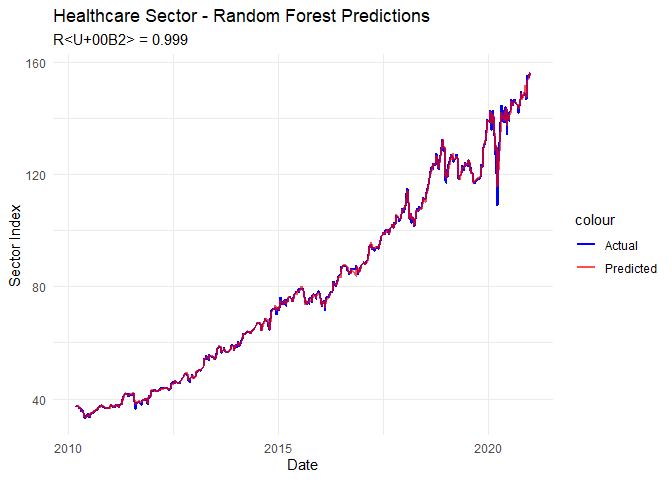
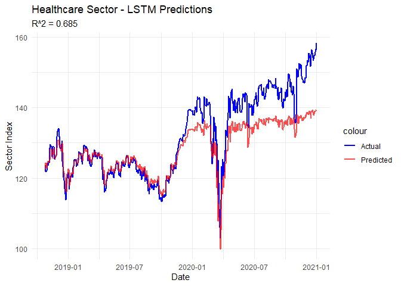

<!-- README.md is generated from README.Rmd. Please edit that file -->

# stocksr

<!-- badges: start -->

[](https://github.com/omnia99-hub/stocksr/actions/workflows/R-CMD-check.yaml)
<!-- badges: end -->

## The **stocksr** R package provides tools for cleaning, transforming, analyzing, and modeling sector-level stock market data, specifically focused on the Energy and Healthcare sectors using S&P 500 daily price data (2010–2020). It supports financial data analysis, time-series forecasting, and feature engineering for sector-specific insights.

## Overview

This package provides a comprehensive framework to: - Load and clean raw
stock data from Excel files - Segment data by market sectors (e.g.,
Energy, Healthcare) - Compute key technical indicators (e.g., MACD, RSI,
Bollinger Bands) - Construct machine learning models such as Random
Forests - Compare model performance across different market sectors

### Data Preparation

- `load_and_preprocess_data()`: Load data and organize by sectors.
- `calculate_sector_index()`: Aggregate individual stock prices into
  sector-level index series.

### Feature Engineering

- `calculate_technical_indicators()`: Compute popular technical
  indicators (RSI, MACD, etc.) for each sector.
- `prepare_data_for_lstm()`: Format data into 3D sequences for LSTM
  input.

### Modeling

- `build_random_forest_model()`: Train a Random Forest model to predict
  stock movements based on engineered features.
- `build_lstm_model()`: Train a LSTM to predict stock movements based on
  engineered features.

## Installation

You can install the development version of **stocksr** as follows:

``` r
# install.package("omnia99-hub/stocksr")
devtools::install_github("omnia99-hub/stocksr")
```

To get started on using this repository, you can also type the following
into your favorite git command line tool:

``` r
# git clone git@github.com/omnia99-hub/stocksr.git
```

The previous command will install the package onto your computer. All
necessary raw data is already included within the package and can be
accessed directly without additional downloads.

## Example

``` r
devtools::load_all(".")
library(stocksr)
```

``` r
library(ggplot2)
library(dplyr)
```

# Step 1: Load and preprocess raw CSV data

``` r
data(df_cleaned2)
sectors <- load_and_preprocess_data(df_cleaned2)
#> [1] "Energy"     "Healthcare"
head(sectors$Healthcare,5)
#>         Date johnson_&_johnson unitedhealth_group eli_lilly  pfizer
#> 1 2010-01-01             64.41              30.48     35.71 17.2432
#> 2 2010-01-04             64.68              31.53     35.82 17.9447
#> 3 2010-01-05             63.93              31.48     35.19 17.6887
#> 4 2010-01-06             64.45              31.79     35.45 17.6318
#> 5 2010-01-07             63.99              33.01     35.27 17.5655
#>   merck_&_company
#> 1         34.8418
#> 2         35.2900
#> 3         35.4330
#> 4         35.9098
#> 5         35.9670
head(sectors$Energy,5)
#>         Date exxon_mobil chevron conocophillips schlumberger eog_res.
#> 1 2010-01-01       68.19   76.99        38.9317        65.09   48.650
#> 2 2010-01-04       69.15   79.06        40.0828        67.11   50.190
#> 3 2010-01-05       69.42   79.62        40.1209        67.30   49.575
#> 4 2010-01-06       70.02   79.63        40.4106        68.80   49.740
#> 5 2010-01-07       69.80   79.33        40.2505        69.51   49.275
```

# Step 2: Calculate sector index

``` r
health_care <- calculate_sector_index(sectors[["Healthcare"]])
head(health_care)
#>         Date sector_index
#> 1 2010-01-01     36.53700
#> 2 2010-01-04     37.05294
#> 3 2010-01-05     36.74434
#> 4 2010-01-06     37.04632
#> 5 2010-01-07     37.16050
#> 6 2010-01-08     37.11312
energy <- calculate_sector_index(sectors[["Energy"]])
head(energy)
#>         Date sector_index
#> 1 2010-01-01     59.57034
#> 2 2010-01-04     61.11856
#> 3 2010-01-05     61.20718
#> 4 2010-01-06     61.72012
#> 5 2010-01-07     61.63310
#> 6 2010-01-08     61.95324
```

# Step 3: Generate technical indicators

``` r
features_healthcare <- calculate_technical_indicators(health_care)
head(features_healthcare)
#>         Date sector_index log_price       returns   log_returns      MA5
#> 1 2010-03-11     37.01920  3.611437  0.0054477870  0.0054330015 36.90919
#> 2 2010-03-12     36.92878  3.608991 -0.0024425163 -0.0024455041 36.88744
#> 3 2010-03-15     37.09344  3.613440  0.0044588530  0.0044489417 36.93448
#> 4 2010-03-16     37.25966  3.617911  0.0044811158  0.0044711055 37.02394
#> 5 2010-03-17     37.24888  3.617622 -0.0002893209 -0.0002893628 37.10999
#> 6 2010-03-18     37.60126  3.627038  0.0094601502  0.0094156832 37.22640
#>       EMA5     MA10    EMA10     MA20    EMA20     MA50    EMA50        MACD
#> 1 36.88436 36.81487 36.81657 36.65597 36.78370 37.03687 37.03687 -0.06109699
#> 2 36.89916 36.84770 36.83697 36.69313 36.79752 37.04471 37.03264 -0.02846755
#> 3 36.96392 36.87476 36.88360 36.73853 36.82570 37.04552 37.03502  0.03305842
#> 4 37.06250 36.91520 36.95198 36.78124 36.86703 37.05583 37.04383  0.11676145
#> 5 37.12463 36.96571 37.00596 36.81093 36.90340 37.05988 37.05187  0.17856724
#> 6 37.28351 37.06780 37.11420 36.85105 36.96986 37.06869 37.07342  0.30076921
#>   MACD_signal volatility5 volatility20    lag_1 log_return_lag_1    lag_2
#> 1 -0.26048563 0.006717456  0.005906557 36.81862     0.0001700371 36.81236
#> 2 -0.21408202 0.003837536  0.005629483 37.01920     0.0054330015 36.81862
#> 3 -0.16465393 0.003492003  0.005674915 36.92878    -0.0024455041 37.01920
#> 4 -0.10837085 0.003396218  0.005614687 37.09344     0.0044489417 36.92878
#> 5 -0.05098324 0.003477397  0.005459812 37.25966     0.0044711055 37.09344
#> 6  0.01936725 0.004632110  0.005755304 37.24888    -0.0002893628 37.25966
#>   log_return_lag_2    lag_5 log_return_lag_5 day_of_week month
#> 1    -0.0012450019 36.58036    -0.0044591082         Thu   Mar
#> 2     0.0001700371 37.03756     0.0124210485         Fri   Mar
#> 3     0.0054330015 36.85822    -0.0048538726         Mon   Mar
#> 4    -0.0024455041 36.81236    -0.0012450019         Tue   Mar
#> 5     0.0044489417 36.81862     0.0001700371         Wed   Mar
#> 6     0.0044711055 37.01920     0.0054330015         Thu   Mar

features_energy <- calculate_technical_indicators(energy)
head(features_energy)
#>         Date sector_index log_price       returns   log_returns      MA5
#> 1 2010-03-11     58.62140  4.071100 -0.0031615112 -0.0031665193 58.59075
#> 2 2010-03-12     58.64934  4.071576  0.0004766178  0.0004765042 58.65267
#> 3 2010-03-15     58.39976  4.067312 -0.0042554614 -0.0042645416 58.61432
#> 4 2010-03-16     58.81604  4.074415  0.0071281115  0.0071028266 58.65877
#> 5 2010-03-17     59.38454  4.084034  0.0096657306  0.0096193163 58.77422
#> 6 2010-03-18     58.84438  4.074896 -0.0090959701 -0.0091375910 58.81881
#>       EMA5     MA10    EMA10     MA20    EMA20     MA50    EMA50       MACD
#> 1 58.44340 57.83743 58.03536 57.38825 57.78901 58.56181 58.56181 0.02443072
#> 2 58.51205 58.06203 58.14699 57.49370 57.87095 58.54339 58.56525 0.12197988
#> 3 58.47462 58.21721 58.19295 57.58667 57.92131 58.48902 58.55876 0.16259946
#> 4 58.58842 58.36021 58.30624 57.63362 58.00652 58.44120 58.56885 0.24961815
#> 5 58.85380 58.55180 58.50229 57.72242 58.13776 58.39448 58.60083 0.39252944
#> 6 58.85066 58.70478 58.56449 57.76649 58.20506 58.33871 58.61039 0.42589089
#>     MACD_signal volatility5 volatility20    lag_1 log_return_lag_1    lag_2
#> 1 -0.6294061883 0.007975557  0.009655032 58.80732     0.0036374480 58.59380
#> 2 -0.4791289742 0.003017808  0.009477097 58.62140    -0.0031665193 58.80732
#> 3 -0.3507832877 0.003143403  0.009568001 58.64934     0.0004765042 58.62140
#> 4 -0.2307030004 0.004723745  0.008218529 58.39976    -0.0042645416 58.64934
#> 5 -0.1060565119 0.006171314  0.008338556 58.81604     0.0071028266 58.39976
#> 6  0.0003329681 0.007778297  0.008589103 59.38454     0.0096193163 58.81604
#>   log_return_lag_2    lag_5 log_return_lag_5 day_of_week month
#> 1     3.925407e-05 57.31458    -2.685062e-03         Thu   Mar
#> 2     3.637448e-03 58.33972     1.772812e-02         Fri   Mar
#> 3    -3.166519e-03 58.59150     4.306470e-03         Mon   Mar
#> 4     4.765042e-04 58.59380     3.925407e-05         Tue   Mar
#> 5    -4.264542e-03 58.80732     3.637448e-03         Wed   Mar
#> 6     7.102827e-03 58.62140    -3.166519e-03         Thu   Mar
```

# Step 4: Train the random forest model

``` r
results_healtcare <- build_random_forest_model(features_healthcare, sector_name = "Healthcare", ntree =1000)
#> 
#> --- Building Random Forest model for Healthcare sector ---
#> Model performance:
#> RMSE: 0.8497 
#> MAE: 0.4578 
#> R<U+00B2>: 0.9994
results_healtcare$prediction_plot
```



``` r
results_healtcare$importance_plot
```


``` r

results_energy <- build_random_forest_model(features_energy, sector_name = "Energy", ntree =1000)
#> 
#> --- Building Random Forest model for Energy sector ---
#> Model performance:
#> RMSE: 0.7325 
#> MAE: 0.4334 
#> R<U+00B2>: 0.9973
results_energy$prediction_plot
```


``` r
results_energy$importance_plot
```

 \#
Step 5: Train the LSTM model

``` r
lstm_results_healthcare <- build_lstm_model(health_care, sector_name = "Healthcare")
#> 
#> --- Building LSTM model for Healthcare sector ---
#> Epoch 1/30, Train Loss: 0.2130, Val Loss: 0.8859
#> Epoch 2/30, Train Loss: 0.0204, Val Loss: 0.3415
#> Epoch 3/30, Train Loss: 0.0126, Val Loss: 0.2259
#> Epoch 4/30, Train Loss: 0.0097, Val Loss: 0.1524
#> Epoch 5/30, Train Loss: 0.0087, Val Loss: 0.1292
#> Epoch 6/30, Train Loss: 0.0085, Val Loss: 0.1148
#> Epoch 7/30, Train Loss: 0.0082, Val Loss: 0.0973
#> Epoch 8/30, Train Loss: 0.0083, Val Loss: 0.0837
#> Epoch 9/30, Train Loss: 0.0079, Val Loss: 0.0807
#> Epoch 10/30, Train Loss: 0.0074, Val Loss: 0.0872
#> Epoch 11/30, Train Loss: 0.0074, Val Loss: 0.0844
#> Epoch 12/30, Train Loss: 0.0071, Val Loss: 0.0695
#> Epoch 13/30, Train Loss: 0.0076, Val Loss: 0.0766
#> Epoch 14/30, Train Loss: 0.0076, Val Loss: 0.0595
#> Epoch 15/30, Train Loss: 0.0071, Val Loss: 0.0706
#> Epoch 16/30, Train Loss: 0.0075, Val Loss: 0.0787
#> Epoch 17/30, Train Loss: 0.0068, Val Loss: 0.0725
#> Epoch 18/30, Train Loss: 0.0071, Val Loss: 0.0667
#> Epoch 19/30, Train Loss: 0.0067, Val Loss: 0.0582
#> Epoch 20/30, Train Loss: 0.0063, Val Loss: 0.0673
#> Epoch 21/30, Train Loss: 0.0068, Val Loss: 0.0663
#> Epoch 22/30, Train Loss: 0.0070, Val Loss: 0.0583
#> Epoch 23/30, Train Loss: 0.0063, Val Loss: 0.0477
#> Epoch 24/30, Train Loss: 0.0066, Val Loss: 0.0562
#> Epoch 25/30, Train Loss: 0.0061, Val Loss: 0.0562
#> Epoch 26/30, Train Loss: 0.0060, Val Loss: 0.0491
#> Epoch 27/30, Train Loss: 0.0061, Val Loss: 0.0427
#> Epoch 28/30, Train Loss: 0.0062, Val Loss: 0.0477
#> Epoch 29/30, Train Loss: 0.0062, Val Loss: 0.0320
#> Epoch 30/30, Train Loss: 0.0070, Val Loss: 0.0335
#> Model performance:
#> RMSE: 6.3166 
#> MAE: 4.5576 
#> R^2: 0.6851
lstm_results_healthcare$prediction_plot
```



``` r
lstm_results_energy <- build_lstm_model(energy, sector_name = "Energy")
#> 
#> --- Building LSTM model for Energy sector ---
#> Epoch 1/30, Train Loss: 0.2712, Val Loss: 0.5030
#> Epoch 2/30, Train Loss: 0.0267, Val Loss: 0.2352
#> Epoch 3/30, Train Loss: 0.0156, Val Loss: 0.1789
#> Epoch 4/30, Train Loss: 0.0148, Val Loss: 0.1707
#> Epoch 5/30, Train Loss: 0.0139, Val Loss: 0.1475
#> Epoch 6/30, Train Loss: 0.0135, Val Loss: 0.1659
#> Epoch 7/30, Train Loss: 0.0139, Val Loss: 0.1684
#> Epoch 8/30, Train Loss: 0.0138, Val Loss: 0.1393
#> Epoch 9/30, Train Loss: 0.0123, Val Loss: 0.1339
#> Epoch 10/30, Train Loss: 0.0135, Val Loss: 0.1321
#> Epoch 11/30, Train Loss: 0.0120, Val Loss: 0.1178
#> Epoch 12/30, Train Loss: 0.0132, Val Loss: 0.0969
#> Epoch 13/30, Train Loss: 0.0124, Val Loss: 0.1098
#> Epoch 14/30, Train Loss: 0.0124, Val Loss: 0.0922
#> Epoch 15/30, Train Loss: 0.0120, Val Loss: 0.1004
#> Epoch 16/30, Train Loss: 0.0121, Val Loss: 0.1155
#> Epoch 17/30, Train Loss: 0.0122, Val Loss: 0.0993
#> Epoch 18/30, Train Loss: 0.0119, Val Loss: 0.1071
#> Epoch 19/30, Train Loss: 0.0116, Val Loss: 0.1065
#> Early stopping at epoch 19
#> Model performance:
#> RMSE: 4.57 
#> MAE: 2.9097 
#> R^2: 0.9159
lstm_results_energy$prediction_plot
```


## Notes

Input data must have daily stock prices with appropriate company names.

The calculate_technical_indicators function generates lagged features,
moving averages, volatility, and MACD indicators needed for modeling.

build_lstm_model and build_random_forest_model internally handle
training and performance evaluation.

## Output

Each modeling function returns:

Root Mean Squared Error (RMSE)

Mean Absolute Error (MAE)

R-squared (R²)

Trained model object

## Conclusion

The stocksr package provides a fast and easy workflow to simulate
sector-level stock forecasting, focusing only on Energy and Healthcare
sectors.

## Information

- The code in this repository was written by Shalu Shalu, Akhila Akkala,
  Omnia Dafalla, and Amanda Wijesinghe.
